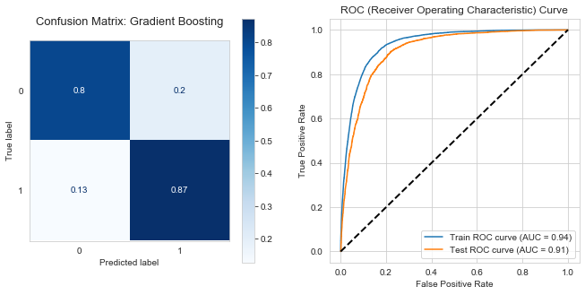
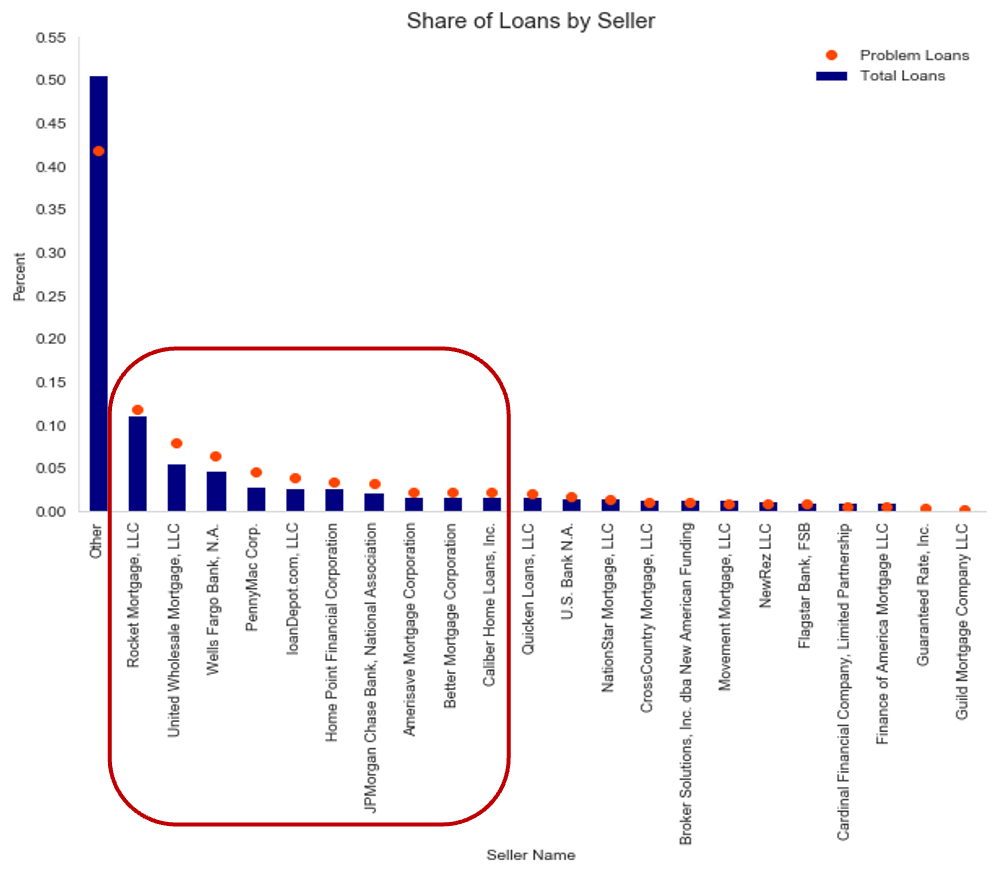

# Predicting Problem Mortgage Loans

Author: Magali Solimano

Date: December 2022

## Project Overview

This analysis applies machine learning to predict the likelihood that a borrower will have problems paying its mortgage loan.

## Objectives

The goal is to identify problem loans and the features that determine them in order to manage credit risk. While mortgage loan delinquencies are currently [very low](https://www.newyorkfed.org/medialibrary/interactives/householdcredit/data/pdf/HHDC_2022Q3), there are signs of potential increasing stress as measured by share of loans that are 30-60 days late but not yet considered 90+ days delinquent. The value-added use case for applying machine learning is to strengthen credit risk management in the current environment as well as during stress periods.

## The Data

Data is obtained from [Fannie Mae's Single Family Loan Data](https://capitalmarkets.fanniemae.com/credit-risk-transfer/single-family-credit-risk-transfer/fannie-mae-single-family-loan-performance-data), which is publicly available and provides a subset of acquisition and performance data through Q2 2022 as of December 2022. This notebook focuses on loans acquired by Fannie Mae in Q1 2021, a quarter of high activity in the single family residential market, and tracks 15 months of performance.

Problem loans are defined as loans with payments that are 90 or more days past due; loans that have been modified, restructured, or received any borrower assistance; and loans that have been foreclosed. A binary variable, problem loans are classified as '1' and performing, non-problem loans as '0'.

## Methods
The analysis utilizes descriptive data analysis and descriptive statistics, in addition to machine learning modelling. Machine learning models used in this analysis are: Decision Tree Classifier, Logistic Regression Classifier, Random Forest Classifier, Gradient Boosting Classifier, and XGBoost Classifier.

## Results


After fitting a number of different models, the Gradient Boosting model is selected as the best performing model. It has an f1 score of 85%, indicative of the model's combined precision and recall performance, and ROC_AUC score of 91% for the test set. The model has a true positive rate of 87%, meaning that 87% of predicted problem loans are indeed problematic, and the false positive rate is 20%. The false negative rate is low at 13%.

The model identifies borrower credit score, combined loan-to-value, debt-to-income,
unpaid principal balance, and interest rate at origination as the top five most important features determining whether a loan is classified as a problem loan. These findings are not surprising, as these metrics are commonly used in credit risk assessments.


Interestingly, the model also identifies several sellers of loans that are important in determining the classification of a loan as problematic, such as Rocket Mortgage, Wells Fargo, Home Point Financial, NewRez, and Better Mortgage, although their feature importance scores are low. In addition, it also identifies a number of states that are important determinants--some of these states are the most populated (such as New York and California), but the results also highlight less populated states such as Washington, Louisiana, Colorado, and New Jersey.

## Recommendations
Based on results of the best performing model--the Gradient Boosting model--the findings can be used to adjust the criteria Fannie Mae applies to the loans they acquire and guarantee, as well as to focus its credit risk management resources, including analysis and loan resolution, on loans that are likely to be problem loans. Problem loans have, on average:

- lower borrower credit score of 725 (compared to 766 for performing loans)
- higher combined loan-to-value ratio of 79% (compared to 67% for performing loans)
- higher debt-to-income ratios of 38% (compared to 32% for performing loans)


By location, mortgage loans in the states of Washington, Louisiana, Colorado, and New Jersey, in addition to more populated states such as New York and California, should be monitored more closely for problem loans compared to other states.

By seller, the performance of mortgage loans sold by Rocket Mortgage, Wells Fargo, Home Point Financial, NewRez, and Better Mortgage should be examined more closely for problem loans compared to other identified sellers.


## Next Steps
Next steps include continuing to improve model performance, as well as broadening the geographical assessment of problem loans by zipcode and predicting the value of losses for problem loans.

## More Information
See the full analysis in the [Jupyter Notebook](https://github.com/magalisolimano/predicting_problem_mortgages/blob/master/notebook.ipynb) or review the [presentation](https://github.com/magalisolimano/predicting_problem_mortgages/blob/master/presentation.pdf). For additional information, contact Magali Solimano at magali.solimano@gmail.com.


## Repository Structure
```
├── images
├── .gitignore
├── README.md
├── notebook.ipynb
└── presentation_phase4.pdf
```
