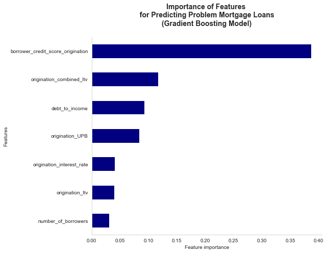

# Predicting Problem Mortgage Loans

Author: Magali Solimano

Date: December 2022

## Project Overview

This analysis applies machine learning to predict the likelihood that a borrower will have problems paying its mortgage loan.

## Objectives

The goal is to identify problem loans and the features that determine them in order to manage credit risk. While mortgage loan delinquencies are currently [very low](https://www.newyorkfed.org/microeconomics/hhdc), the value-added use case of
the machine learning model would strengthen credit risk management in the current environment as well as during stress periods.


## The Data

Data is obtained from [Fannie Mae's Single Family Loan Data](https://capitalmarkets.fanniemae.com/credit-risk-transfer/single-family-credit-risk-transfer/fannie-mae-single-family-loan-performance-data), which is publically available and provides a subset of acquisition and performance data through Q2 2022 as of December 2022. This notebook focuses on loans acquired by Fannie Mae in Q1 2021, a quarter of high activity in the single family residential market, and tracks 15 months of performance.

Problem loans are defined as loans with payments that are 90 or more days past due; loans that have been modified, restructured, or received any borrower assistance; and loans that have been foreclosed. A binary variable, problem loans are classified as '1' and performing, non-problem loans as '0'.

## Methods
The analysis utilizes descriptive data analysis and descriptive statistics, in addition to machine learning modelling.

## Results



After fitting a number of different models, the XG Boost model is selected as best model, with f1 score of 84% and ROC_AUC score of 90.5% for the test set.

The model identifies combined loan-to-value ratio, borrower credit score, number of borrowers, number of units, and debt-to-income ratio as the top five most important features determining whether a loan is classified
as a problem loan. These findings are not surprising, as these metrics are commonly used in credit risk assessments.

Interestingly, the model also identifies several sellers of loans that are important in determining the classification of a loan as problematic (such as Flagstar Bank and Better Mortgage). In addition, it also identifies a number of states that are important determinants--some of these states are the most populated (such as New York and California), but the results also highlight less populated states such as Louisiana, New Mexico, and Oklahoma.


## Recommendations
Based on results of the best performing model--the XGBoost model--Fannie Mae should focus credit risk management resources, including analysis and loan resolution, on loans that are likely to be problem loans,
which have on average:

- combined loan-to-value ratio of 79% (compared to 67%)
- borrower credit score of 725 (compared to 766 for performing loans)
- debt-to-income ratios of 38% (compared to 32%)

By location, mortgage loans in the states of Louisiana, New Mexico, and Oklahoma in addition to more populated states such as New York and California, should be monitored more closely for problem loans compared to other states. Delaware, Hawaii, and Rhode Island also have feature importance, in this case more likely in support of performing (non-problem) loans.

By seller, the performance of mortgage loans sold by Flagstar Bank and Better Mortgage should be examined more closely for problem loans compared to other identified sellers. Movement Mortgage, Quicken Loans, Rocket Mortgage,
Cardinal Financial and 'other' sellers are also significant, in this case increasing the likelihood of performing (non-problem) loans.

## Next Steps
Next steps include continuing to improve model performance, as well as broadening the geographical assessment of problem loans by zipcode and predicting the value of losses for problem loans.

## More Information
See the full analysis in the [Jupyter Notebook](https://github.com/magalisolimano/predicting_problem_mortgages/blob/master/notebook.ipynb) or review the [presentation](https://github.com/magalisolimano/time-series/blob/main/presentation_phase4.pdf). For additional information, contact Magali Solimano at magali.solimano@gmail.com.


## Repository Structure
```
├── data
├── images
├── README.md
├── notebook.ipynb
└── presentation_phase4.pdf
```
